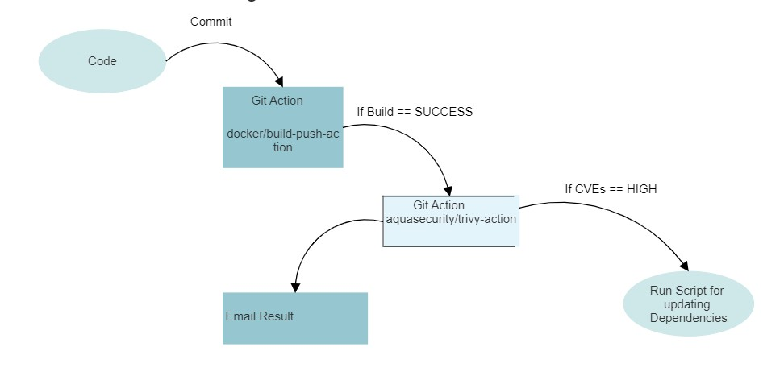

# Creating a Docker image of a MERN stack app also How to detect and address CVEs in Docker images using Trivy, and how to automate the detection and updating process.
Docker is a popular containerization platform that allows you to build and deploy applications in a lightweight and portable manner. In this post, we'll discuss how to get started with Docker, how to create a Docker image of a MERN stack app, how to detect and address CVEs in Docker images using Trivy, and how to automate the detection and updating process.
## Getting Started with Docker
Here are the steps you can follow to get started with Docker:
### Install Docker Desktop:
- Docker Desktop is a powerful tool that allows you to build, test, and deploy Docker images on your machine. You can download Docker Desktop for Windows, macOS, or Linux from the Docker website.

### Test Docker:
- To test that Docker is working correctly, you can run the following command in a command prompt or terminal window:
` docker run hello-world `
### Create a Dockerfile:
- A Dockerfile is a script that contains instructions for building a Docker image. You can create a Dockerfile for your application by using a text editor and saving it with the nameDockerfile in your application directory.

### Build a Docker image:
- You can build a Docker image by using the docker build command. For example, if your application is in a directory named my-app, you can run the following command to build a Docker image:
`docker build -t my-app-image my-app`
### Run a Docker container:
- You can run a Docker container based on your Docker image by using the docker run command. For example, you can run the Docker container you created in step 4 with the following command:
`docker run -p 3000:3000 my-app-image`
- This command will run the my-app-image Docker container and map port 3000 on your host machine to port 3000 in the container.

## Creating a Docker Image of a MERN Stack App
The MERN stack is a popular web development stack that consists of MongoDB, Express, React, and Node.js. Here's how you can create a Docker image of a MERN stack app:

### Install Node.js:
- Node.js is required to run the backend server and build the frontend client. You can download Node.js from the Node.js website.

### Create a MERN stack app:
- You can create a MERN stack app by using a tool like create-react-app and following the steps to set up the backend server with Express and MongoDB. For example, you can create a MERN stack app with the following commands:

`npx create-react-app my-app cd my-app npm install express mongoose`

### Update the package.json file:
You need to update the package.json file to include a script for building the client and starting the server.
```sh
"scripts": {
    "start": "node server.js",
    "client": "cd client && npm start",
    "server": "nodemon server.js",
    "dev": "concurrently \"npm run server\" \"npm run client\""
  }
```
### Build a Docker image:
You can build a Docker image by using the `docker build` command. For example, if your application is in a directory named `my-app`, you can run the following command to build a Docker image:
`docker build my-app`

## Detecting and Addressing CVEs in Docker Compose
Trivy is a simple and comprehensive vulnerability scanner for containers. It can scan container images and report any vulnerabilities found in their components. Here's how you can use Trivy to detect and address CVEs in Docker Compose:

### Install Trivy:
You can install Trivy on your system by following the instructions on the Trivy website.

### Scan your Docker Image:
You can scan your Docker image by using the trivy image command. For example, if your Docker image named my-app-image, you can run the following command to scan it:
                        `trivy image my-app-image`
### Review the results:
Trivy will output a list of vulnerabilities found in the image's components. Review the results and take appropriate actions to address any critical or high vulnerabilities.

### Update your dependencies:
If any vulnerabilities are found in your image's components, you need to update your dependencies to address them. Depending on the nature of the vulnerability, you may need to update your dependencies to a newer version, apply a security patch, or take other corrective actions.

### Rebuild your image and redeploy your application:
After updating your dependencies, you need to rebuild your image and redeploy your application to ensure that the vulnerabilities are no longer present.

## Automating the Detection and Updating Process
Detecting and updating vulnerabilities in container images can be a time-consuming and error-prone process. Here's how you can automate the detection and updating process using a CI/CD pipeline:
### Set up a CI/CD pipeline:
You can set up a CI/CD pipeline using a tool like GitHub Actions, Jenkins, or GitLab CI/CD. Your CI/CD pipeline should include steps for building your Docker image, scanning it with Trivy, and taking appropriate actions based on the results.

### Integrate Trivy into your pipeline:
You can integrate Trivy into your pipeline by using a Trivy action or by calling the Trivy CLI directly. For example, if you're using GitHub Actions, you can use the docker/build-push-action and aquasecurity/trivy-action actions to build your image and scan it with Trivy.

### Configure notifications and alerts:
You can configure notifications and alerts to inform you of any vulnerabilities found in your images. For example, you can use the Slack or Email actions to send notifications to your team when vulnerabilities are found.

### Automate updating dependencies:
You can automate updating your dependencies by using a tool like Renovate, which can automatically detect and update dependencies in your Docker Compose file. For example, you can configure Renovate to scan your Docker Compose file for vulnerabilities and automatically update any vulnerable dependencies to their latest non-vulnerable versions.


By automating the detection and updating process, you can ensure that your container images are always up-to-date and free of vulnerabilities, without the need for manual intervention.
### Flow Diagram of above procedure:

## Conclusion:
In this blog, I've covered the basics of getting started with Docker, including how to build a Docker image from a MERN stack application and how to convert that image to Docker Compose. We've also discussed how to detect and address CVEs in Docker and Docker Compose using Trivy, and how to automate the detection and updating process using a CI/CD pipeline.

Docker is a powerful tool for building and deploying applications in a containerized environment, and with the help of Trivy and CI/CD pipelines, you can ensure that your Docker images are always up-to-date and free of vulnerabilities. By following the steps outlined in this blog, you can streamline the process of building, deploying, and maintaining your Docker-based applications.
